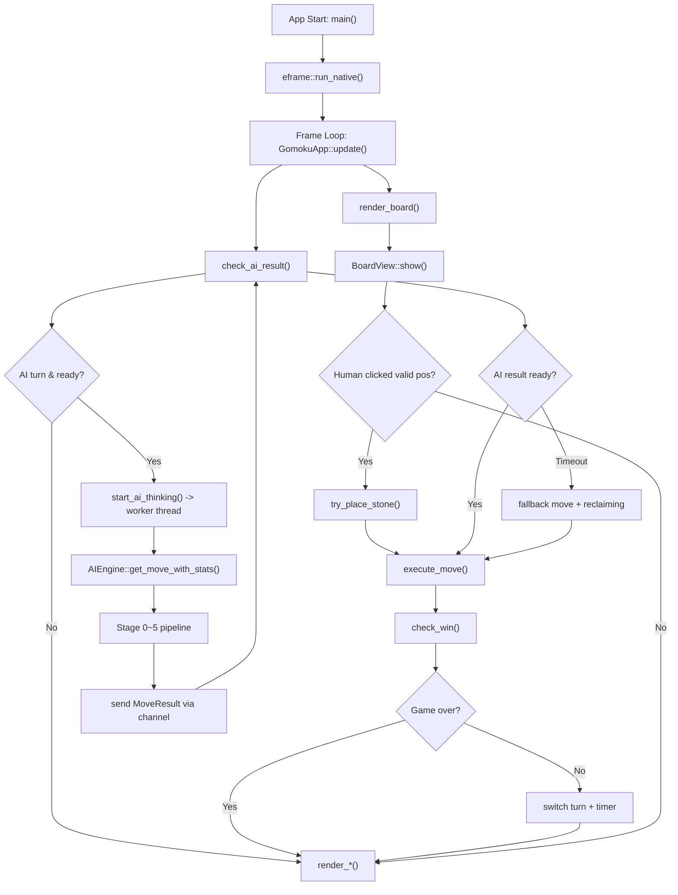
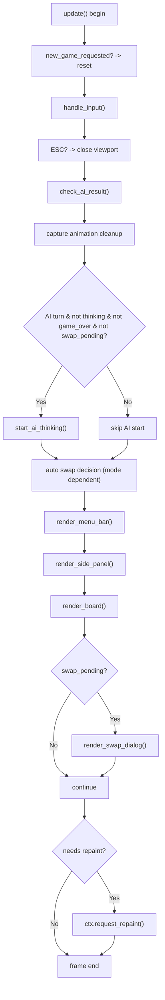
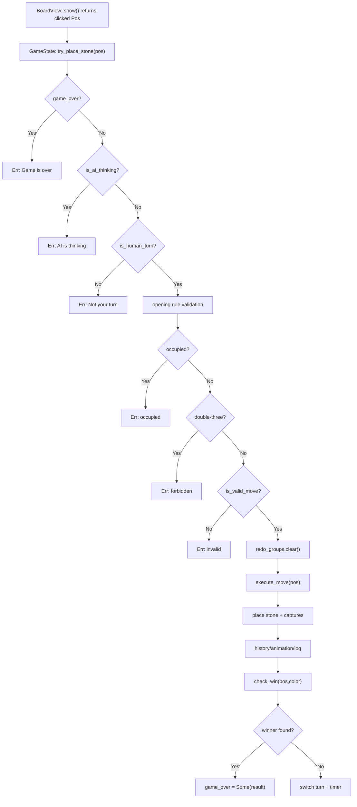
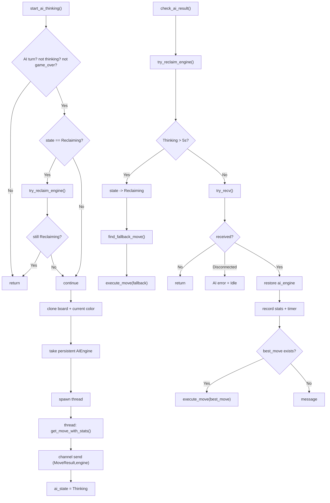
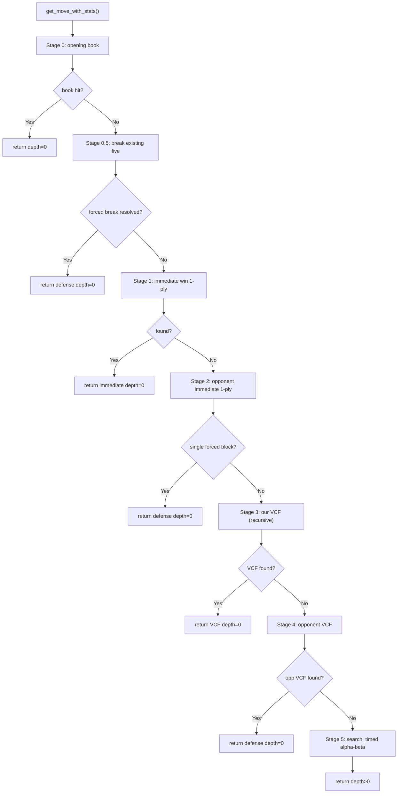
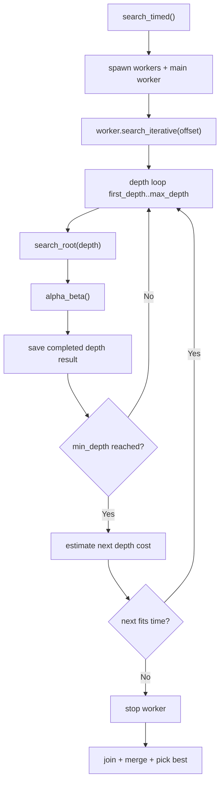
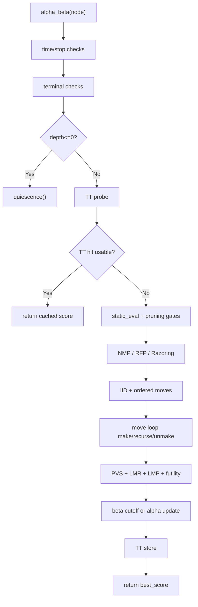
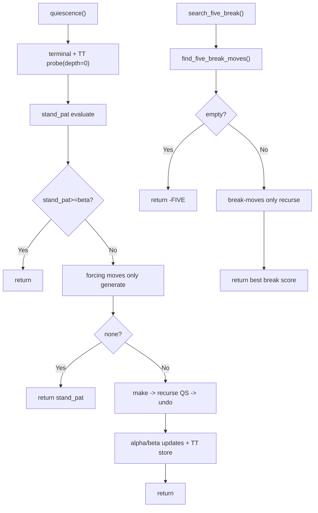

# Gomoku Workflow Deep Dive (대화 기반 상세 문서)

> 이 문서는 **"코드가 실제로 어떤 순서로 실행되는지"**를 기준으로, 우리가 대화에서 하나씩 확인한 내용을 정리한 워크플로우 문서입니다.
>
> 목표는 다음 2가지입니다.
> 1. Rust를 잘 모르는 상태에서도 전체 호출 흐름을 따라갈 수 있다.
> 2. 각 단계의 핵심 개념(Alpha-Beta, Negamax, VCF, TT, Depth/Time 지표)을 코드 기준으로 정확히 설명할 수 있다.

---

## 목차

1. [문서 사용법](#문서-사용법)
2. [가장 먼저: Cargo와 크레이트 경로](#가장-먼저-cargo와-크레이트-경로)
3. [진입점: `main.rs`](#진입점-mainrs)
4. [UI 메인 루프: `GomokuApp::update`](#ui-메인-루프-gomokuappupdate)
5. [사람 착수 흐름: 클릭 -> `try_place_stone` -> `execute_move`](#사람-착수-흐름-클릭---try_place_stone---execute_move)
6. [AI 비동기 흐름: `start_ai_thinking` / `check_ai_result`](#ai-비동기-흐름-start_ai_thinking--check_ai_result)
7. [AI 엔진 최상위 파이프라인: Stage 0~5](#ai-엔진-최상위-파이프라인-stage-05)
8. [Stage 5 상세: `search_timed -> search_iterative -> search_root -> alpha_beta`](#stage-5-상세-search_timed---search_iterative---search_root---alpha_beta)
9. [`quiescence()`와 `search_five_break()`](#quiescence와-search_five_break)
10. [휴리스틱/가지치기 용어 사전](#휴리스틱가지치기-용어-사전)
11. [점수/시간/depth 지표 해석](#점수시간depth-지표-해석)
12. [오해하기 쉬운 포인트 FAQ](#오해하기-쉬운-포인트-faq)
13. [Mermaid 시각화 모음](#mermaid-시각화-모음)
14. [한 턴 체크리스트](#한-턴-체크리스트)

---

## 문서 사용법

- 이 문서는 **요약 문서가 아니라 흐름 문서**입니다.
- 추천 순서:
  1. 2~4장으로 "어디서 시작해서 프레임마다 뭘 하는지"를 이해
  2. 5~7장으로 "실제 수가 어떻게 결정되는지"를 이해
  3. 8~11장으로 탐색 알고리즘/지표를 정확히 잡기
  4. 13장의 다이어그램으로 전체 재확인

---

## 가장 먼저: Cargo와 크레이트 경로

### 1) Cargo가 무엇인가

- Cargo는 Rust의 빌드/실행/의존성 관리자입니다.
- C++ 비유:
  - `CMake + package manager + build runner`를 합친 느낌

이 프로젝트에서 확인한 파일:
- `Cargo.toml`

핵심 설정:
- `[lib] name = "gomoku" path = "src/lib.rs"`
- `[[bin]] name = "gomoku" path = "src/main.rs"`

의미:
- 라이브러리 크레이트 이름은 `gomoku`
- 실행 바이너리 엔트리포인트는 `src/main.rs`

### 2) `gomoku::ui::GomokuApp`가 왜 되는가

경로 해석:
1. `gomoku` -> `src/lib.rs` (`[lib] name`으로 결정)
2. `ui` -> `src/lib.rs`의 `pub mod ui;`
3. `GomokuApp` -> `src/ui/mod.rs`의 `pub use app::GomokuApp;`

즉 `main.rs`에서 `use gomoku::ui::GomokuApp;`가 성립합니다.

---

## 진입점: `main.rs`

파일: `src/main.rs`

```rust
use gomoku::ui::GomokuApp;

fn main() -> Result<(), eframe::Error> {
    let options = eframe::NativeOptions {
        viewport: egui::ViewportBuilder::default()
            .with_inner_size([1000.0, 750.0])
            .with_min_inner_size([800.0, 600.0])
            .with_title("Gomoku - 42 Project"),
        ..Default::default()
    };

    eframe::run_native(
        "Gomoku",
        options,
        Box::new(|cc| Ok(Box::new(GomokuApp::new(cc)))),
    )
}
```

역할은 단순합니다:
1. 창 옵션 세팅
2. `run_native`로 GUI 루프 시작
3. `GomokuApp` 인스턴스 생성 방식 등록

핵심: 실제 게임 로직은 `main.rs`가 아니라 `GomokuApp::update()`에서 반복 실행됩니다.

---

## UI 메인 루프: `GomokuApp::update`

파일: `src/ui/app.rs`

`update()`는 매 프레임 호출됩니다.

처리 순서:
1. 새 게임 요청 처리
2. 키 입력 처리
3. ESC 종료 처리
4. AI 결과 폴링 (`check_ai_result`)
5. 애니메이션 정리
6. AI 시작 조건 검사 후 `start_ai_thinking`
7. Swap rule 자동 결정(모드별)
8. 렌더링 (`render_menu_bar`, `render_side_panel`, `render_board`)
9. 필요 시 `request_repaint`

한 줄 요약:
- `update()` = 입력 + 상태 업데이트 + 렌더링 오케스트레이터

---

## 사람 착수 흐름: 클릭 -> `try_place_stone` -> `execute_move`

### 1) 클릭 수집

- `BoardView::show()`가 클릭 좌표를 `Option<Pos>`로 반환
- `render_board()`가 클릭 결과를 `GameState::try_place_stone(pos)`로 전달

### 2) `try_place_stone` (착수 전 검문소)

파일: `src/ui/game_state.rs`

검사 순서:
1. 게임 종료 여부
2. AI thinking 여부
3. 사람 턴 여부
4. Pro opening rule 제약
5. 점유 여부
6. 쌍삼 금지 (`is_double_three`)
7. 최종 유효수 (`is_valid_move`)

통과 시:
- `redo_groups.clear()`
- `execute_move(pos)`

### 3) `execute_move` (실제 상태 반영)

순서:
1. 보드에 돌 놓기 (`place_stone`)
2. 캡처 실행 (`execute_captures`)
3. 애니메이션/히스토리/로그 업데이트
4. 승패 체크 (`check_win`)
5. 종료 아니면 턴 전환

### 4) `check_win`

판정 규칙:
1. 캡처 5쌍 승리
2. 상대가 이전 턴에 만든 5목이 아직 살아있으면 상대 승리
3. 내가 만든 5목이 **캡처로 깨지지 않으면** 승리

---

## AI 비동기 흐름: `start_ai_thinking` / `check_ai_result`

### 왜 비동기인가

- 탐색은 무거워서 UI 스레드에서 동기 실행하면 프리즈됩니다.
- 그래서 별도 스레드에서 계산하고 UI는 매 프레임 폴링합니다.

### 1) `start_ai_thinking`

순서:
1. AI 시작 조건 검사
2. 보드 복사 + 현재 엔진 가져오기(캐시 재사용)
3. 스레드 생성
4. 스레드에서 `engine.get_move_with_stats(board, color)`
5. 채널로 `(MoveResult, engine)` 전송
6. `ai_state = Thinking`

### 2) `check_ai_result`

순서:
1. Reclaiming 상태면 엔진 회수 시도
2. timeout(5초) 검사
3. timeout이면 fallback move 실행 + Reclaiming 전환
4. 결과 수신되면 엔진 복귀, 통계 기록, `execute_move`

### 왜 Reclaiming이 필요한가

- timeout 순간 스레드를 강제 종료하지 않고, 끝날 때 엔진/TT 캐시를 회수하기 위함
- TT를 유지해야 이후 턴 탐색 품질/속도가 유지됨

---

## AI 엔진 최상위 파이프라인: Stage 0~5

파일: `src/engine.rs` `get_move_with_stats`

### Stage 0: Opening book

- 초반 정형 대응이면 즉시 반환

### Stage 0.5: Break existing five

- 상대가 이미 breakable five를 갖고 있으면 반드시 대응
- 단순 차단이 아니라 "상대가 unbreakable 재생성 가능한가"까지 검사

### Stage 1: Immediate win (1-ply tactical scan)

- 모든 합법수에 대해 make/unmake
- 즉시 승리 수(5목, 캡처승) 찾으면 즉시 반환

### Stage 2: Opponent immediate threats (1-ply tactical scan)

- 상대 즉승 수 목록 탐색
- 단일 강제 차단 수면 즉시 수비 반환

### Stage 3: Our VCF

- `search_vcf(board, color)`
- 재귀 강제수순 탐색 (단순 1-ply 아님)

### Stage 4: Opponent VCF

- 상대 VCF가 있으면 첫 수 차단

### Stage 5: Timed Alpha-Beta

- 위 0~4에서 해결 안 되면 일반 탐색으로 최종 결정

### 중요한 해석: depth=0의 의미

- Stage 0~4 반환은 `MoveResult.depth = 0`
- 이것은 "한 수만 봤다"의 의미가 아니라 "알파베타 depth 지표가 아니다"의 의미
- VCF는 내부적으로 재귀 depth를 사용하지만 `MoveResult.depth`에는 반영하지 않음

---

## Stage 5 상세: `search_timed -> search_iterative -> search_root -> alpha_beta`

## 1) `search_timed`

- Lazy SMP 병렬 실행
- worker 여러 개가 동시에 iterative deepening 수행
- shared TT를 공유
- 종료 후 결과 merge

worker 개수:
- `available_parallelism().min(8)` (기본)

## 2) `search_iterative`

- depth를 반복 증가시키며 탐색
- worker마다 `start_depth_offset`이 달라 시작 depth를 분산
- soft/hard time budget 기반으로 다음 depth 진입 여부 판단

핵심:
- 바깥 루프 depth가 4부터 시작하더라도
- 내부 재귀에서 3,2,1,0을 자동으로 내려가므로 정합성 문제 없음

## 3) `search_root`

- 루트 후보 생성/정렬
- 상위 후보만 탐색
- 첫 수 full-window, 나머지는 PVS
- best move/score 결정

## 4) `alpha_beta`

실행 순서(노드 기준):
1. 시간/중단 체크
2. 터미널 체크
3. depth 바닥이면 quiescence
4. TT probe
5. static eval 기반 pruning
6. NMP
7. IID/TT-move 확보
8. 후보 생성 + 제한
9. make/recurse/unmake 루프 (PVS + LMR + LMP)
10. cutoff/TT-store 후 반환

---

## `quiescence()`와 `search_five_break()`

## 1) `quiescence`

목적:
- depth 바닥에서 곧 터질 전술(5/4/capture-win)만 더 본 뒤 멈춤
- horizon effect 완화

특징:
- stand_pat(`evaluate`) 기반
- forcing move만 탐색
- QS depth 제한 + move count 제한
- QS 결과도 TT(depth=0) 저장

## 2) `search_five_break`

목적:
- breakable five 상황에서 "깨는 수만" 강제 탐색
- 일반 루프보다 규칙 적합성이 높음

---

## 휴리스틱/가지치기 용어 사전

## 휴리스틱이 정확히 무엇인가

- 휴리스틱은 "가중치"만 의미하지 않습니다.
- 정의: **정답 보장보다 속도/실용성을 위해 쓰는 경험적 규칙 전체**

종류:
1. 정렬 휴리스틱: `score_move`
2. 평가 휴리스틱: `evaluate`
3. 가지치기/감축 휴리스틱: NMP/LMR/LMP/Futility/Razoring 등

## 이 코드의 가지치기/감축 개념

강한 컷오프:
1. Alpha-Beta cutoff
2. TT cutoff

선택적(휴리스틱) 가지치기:
1. Reverse Futility Pruning (RFP)
2. Razoring
3. Null Move Pruning (NMP)
4. Futility Pruning
5. Late Move Pruning (LMP)

탐색량 감축(컷오프 외):
1. PVS
2. LMR
3. Aspiration Window
4. IID
5. Adaptive move limit
6. Threat extension
7. Quiescence forcing-only / depth cap / move cap

---

## 점수/시간/depth 지표 해석

### 1) UI의 `AI: xxxms`

- 턴 전체 wall-clock 시간 (비동기 시작~결과 반영)
- Stage 0~5 중 실제 실행된 전체 비용

### 2) `MoveResult.time_ms`

- `get_move_with_stats` 시작 시각 기준 전체 파이프라인 시간
- Stage 5만 따로 재지 않음

### 3) `MoveResult.depth`

- 사실상 Stage 5 알파베타 depth 지표
- Stage 0~4는 depth=0

### 4) `avg_depth`, `avg_time_ms`

파일: `src/ui/game_state.rs` `AiStats`

- 둘 다 `depth > 0`만 필터링
- 즉 알파베타가 실제로 돌았던 수들 기준 평균

중요:
- 전체 체감 평균 시간과, AB 성능 평균 시간은 의도적으로 분리되어 있음

---

## 오해하기 쉬운 포인트 FAQ

### Q1. VCF는 depth가 없나?

- 내부 재귀 depth 있음 (`max_vcf_depth` 기본 30)
- 단 `MoveResult.depth`는 AB 지표라 0으로 반환

### Q2. depth 4부터 시작하면 1,2,3 없이 가능한가?

- 가능
- `alpha_beta(depth=4)` 호출 자체가 내부 재귀로 3,2,1,0을 내려감
- 1->2->3 선행은 성능 최적화(정합성 필수 아님)

### Q3. 모든 worker가 같은 탐색을 하는가?

- 일부 중복은 있음 (Lazy SMP 특성)
- offset + shared TT + 각 worker 로컬 히스토리 차이로 분산/재사용

### Q4. 휴리스틱은 그냥 점수표인가?

- 아니오
- 점수표도 휴리스틱이지만, pruning 규칙들도 휴리스틱임

---

## Mermaid 시각화 모음

> 아래 다이어그램은 이 문서 내용을 한눈에 다시 보는 용도입니다.

### 1) 전체 E2E 워크플로우



### 2) `update()` 프레임 순서



### 3) 사람 착수 흐름



### 4) AI 비동기 파이프라인



### 5) 엔진 Stage 0~5



### 6) Stage 5 내부



### 7) alpha_beta 노드 처리



### 8) quiescence + five_break



---

## 한 턴 체크리스트

아래 순서로 실제 코드를 따라가면 한 턴 호출 흐름을 복기할 수 있습니다.

1. `src/ui/app.rs` `update()`
2. `src/ui/game_state.rs` `check_ai_result()`
3. (사람 턴이면) `render_board()` -> `try_place_stone()`
4. `execute_move()` -> `check_win()`
5. (AI 턴이면) `start_ai_thinking()`
6. thread: `engine.get_move_with_stats()`
7. `engine.rs` Stage 0~5
8. Stage 5: `search_timed()` -> `search_iterative()` -> `search_root()` -> `alpha_beta()`
9. `depth<=0`면 `quiescence()`
10. 특수: `search_five_break()`
11. result channel 복귀 -> `check_ai_result()` -> `execute_move()`
12. 렌더링

---

## 부록: 참고 파일

- `src/main.rs`
- `src/lib.rs`
- `src/ui/app.rs`
- `src/ui/game_state.rs`
- `src/ui/board_view.rs`
- `src/engine.rs`
- `src/search/alphabeta.rs`
- `src/search/threat.rs`
- `src/search/zobrist.rs`
- `src/search/tt.rs`
- `src/rules/capture.rs`
- `src/rules/win.rs`
- `src/rules/forbidden.rs`
- `src/eval/heuristic.rs`
- `src/eval/patterns.rs`

